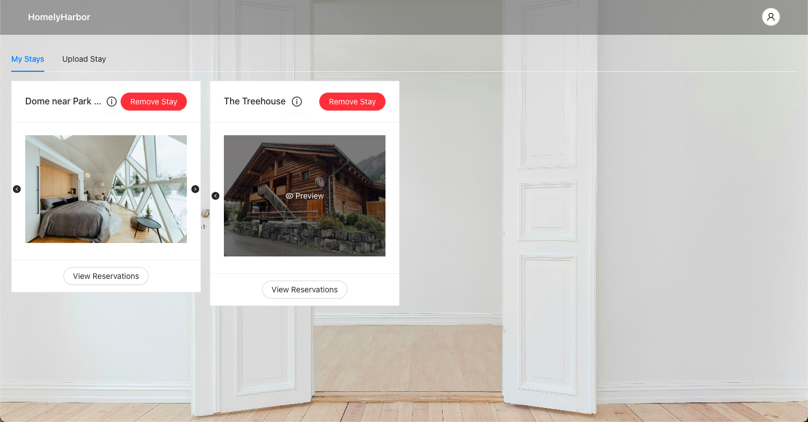

# HomelyHarbor
## _An online web platform for user with different roles (host or guest) to either uploading stay or reservating stays_

Welcome to the backend repository of the HomelyHarbor. The frontend code can be found [here](https://github.com/lan234234/HomelyHarbor-Web-Application-Frontend).

Visit us at: [HomelyHarbor](https://dev1390.d1bx1z9zgvsmt.amplifyapp.com/)

## Features
- **Authentication:** Secure user profiles with registration, login, and logout functionalities.
- **Upload Hotel:** Hosts can upload new hotel listings complete with images and descriptions.
- **Manage Hotel:** Hosts can view their listed hotels and delete any existing entries.
- **Search Hotel:** Guests can search for available hotels with constraints on dates, location, and number of guests.
- **Manage Reservation:** Guests can view their reservation history and manage (add or delete) reservations.

## Demo
Explore screenshots from HomelyHarbor showcasing each of our core features:

### Authentication

### Upload Hotel

### Manage Hotel

### Search Hotel

### Manage Reservation

## Technologies Used ------------------?????????????????????????
- **Spring Boot:** Framework for building Java applications.
- **Java:** Primary programming language for backend development.
- **MySQL:** Database for storing user data and application data.
- **HTML, CSS, JavaScript:** Core technologies for building web frontends.
- **React:** JavaScript library for building user interfaces.
- **Node.js:** JavaScript runtime for building scalable network applications.
- **AntDesign:** UI framework for designing elegant and responsive components.
- **AWS RDS:**
- **Google Cloud Storage:**
- **Google Compute Engine:**
- **Google App Engine:**
- **Google GeoEncoding API:**
- **Google Maps JavaScript API:**
- **GeoIndex:** Tool for geospatial querying and indexing.
- **ElasticSearch:** Search engine to enhance data retrieval capabilities.
- **Token-based Authentication:** Method for securing user sessions and data.

## License
MIT License
